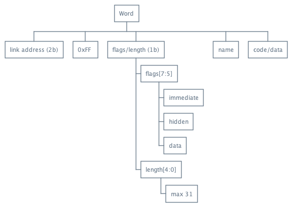
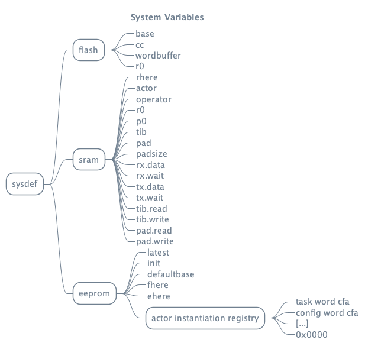
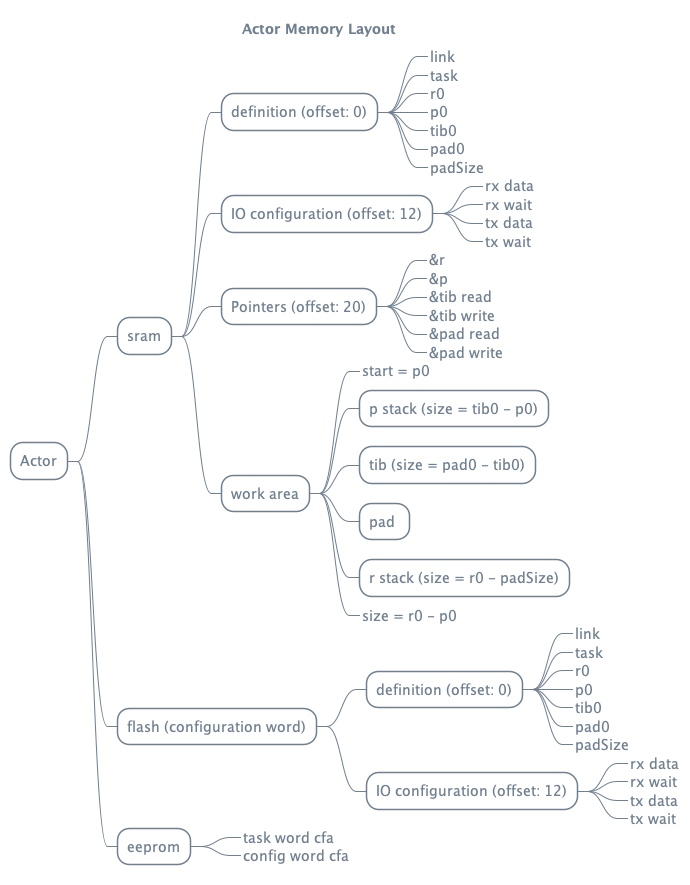
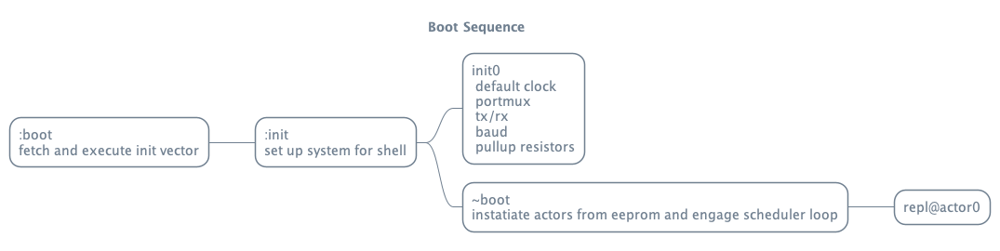
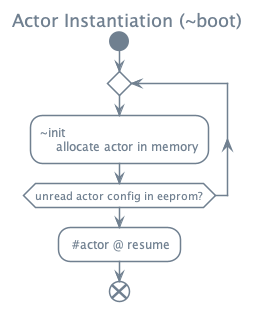
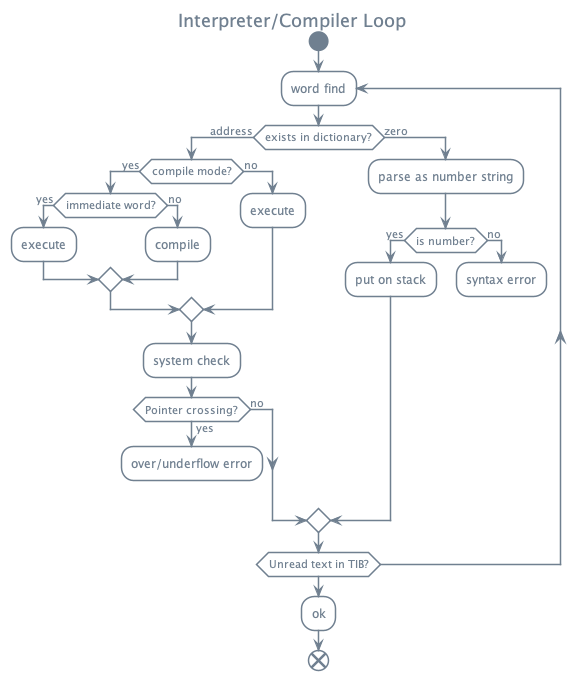

# Design
## Goals 
- Modular
  - Configurable core dictionary
  - Configurable root process, optional scheduler
- Concurrent
  - Self contained Actors
  - Message passing via parameter stack
- Flexible
  - Amenable to distributed computing
  - Easy to interface with sensors and IO devices
- Friendly 
  - Emphasis on quality repl, editor, and debugging tools
  - Transparent responsive terminal with arrow keys, delete, clear, copy/paste

Ymir is structured to allow for multiple concurrent actors to access any of the input or output peripherals independently as well as take control of the interpreter. 

This forth is primarily inspired by Jonesforth, Flashforth, and the descriptions provided in "Starting Forth" as well as "Threaded Interpreted Languages". Additional influences come from Kotlin, Elixir, and Erlang. 

I'm not particularly concerned with the ANS standard, but there will likely be significant overlap in structure with standard Forth. 

Ymir is directly threaded, with the option of indirect threading for running words in ram. Though words may be stored and executed in the eeprom, that space is primarily used for defining which Actors to instantiate on startup and other presistent variables.

When the system is first flashed, it will run the repl on a single actor called `actor0`. Each Actor has its own parameter stack, TIB (terminal-in buffer), and PAD (general purpose buffer), as well as its own configuration for which IO device to use. Each Actor is free to manipulate the kernel or runtime, create new actors, or pass messages via placing items on another Actor's stack. 

Concurrency in this case is implemented with a round robin, non-preemptive scheduling scheme. The Actors form a linked list in memory that can be manipulated to start or cancel coroutines. The start of this null terminated list is at `#actor`, and the currently running actor is stored at `#operator`. Pairs of Task and Configuration vectors in the eeprom are used to determine which Actors to instantiate on startup. 

Optionally, I plan to eventually add either the watchdog timer, or a timer interrupt to impose time limits for each task in real-time use cases. Or possibly, some kind of priority allocator as exists in Simula. 

## Word Structure 
Words are primarily located in the flash memory. Because the system is directly threaded, executable words will have machine code available at their content field address. Data words on the other hand, work via a flag rather than a code field, so data can be placed directly after the name. When the data flag is present, execution puts the content field address on the stack. 

Notice that **the maximum length for a word name is 31 characters**, or the capacity of a 5-bit integer. 

The 0xFF marker is present to allow deriving the word address from the content field address. There are no circumstances where 0xff would be naturally occur between the marker and the CFA--ascii chars are less than 127, and having a word with maximum length and all flags active would be self-contradictory (and hidden). 
# Memory Layout
## System Variables

## Custom IO Registers

|Register | System Name | Description |
|-|-|-|
| reset_r | GPIO_GPIOR0 | debug info from last reset |
| base_r | GPIO_GPIOR1 | current radix |
| num_format | GPIO_GPIOR3 | number fomat register|

|number fomat register detail: | | | |
|-|-|-|-|
| signed[7] (default=true/set) | base-literal flag[6] | 0b | padding [4:0] |

## Reserved CPU Registers 

| Name | Register  | Description |
|-|-|-|
`Z` | r[30:31] | Working pointer: memory read/write, indirect execution
`IH` | r29 | Instruction Pointer 
`IL` | r28 | 
`SH` | r27 | Stack Pointer
`SL` | r26 
`ACAH` | r25 | Accumulator A: 
`ACAL` | r24 | (adiw/sbiw available)
`ACBH` | r23 | Accumulator B:
`ACBL` | r22 | (only add/adc/sub/sbc)
`STAH` | r21 | State register
`STAL` | r20 |     
`TOSH` | r17 | Top of Stack Cache
`TOSL` | r16 | 
`WCH` | r13  | current word cache (contains length/flag)
`WCL` | r12
`zero`| r10  | constant zero
`one` | r11  | constant one

| State register | | | | | | |
|-|-|-|-|-|-|-|
| sign-flag[7] | memory-flag[6:5] | 0b | 0b | 0b | 0b | compile-flag[0] |

| mem_flag detail: | |
|-|-|
01 | sram
10 | eeprom
11 | flash

# Actor Model
An Actor's structure (other than its task word) is determined by its configuration word. 

The task word is the word that will be run each time it's the Actor's turn to execute. Rather than `exit`, task words should end with `yield`, which yields execution control to the next Actor. 

To mark an actor to be instantiated on boot, add the CFA of its task word and its configuration word to the end of the system variable block in the eeprom. A null word must occur at the end of the list, or conversely, a task can be written to zero to nullify all configurations taking place after that point in memory. 

# Boot Sequence
The word `:boot` fetches and executes the user definable `#init` vector. 

By default this process takes the following steps when running after first flash:

After setting up some default hardware parameters, the list of Actors to instantiate at boot are read from the eeprom and allocated into sram. 

# Interpreter / Compiler
This single word is the essence of any Forth system. 

