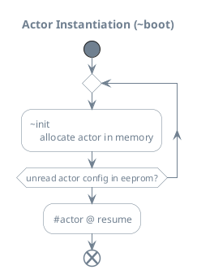

```plantuml
@startuml
skinparam BackgroundColor transparent
skinparam Shadowing false
skinparam activity {
    FontColor SlateGrey
    BackgroundColor transparent
    ArrowColor SlateGrey
    BorderColor SlateGrey
    StartColor SlateGrey
    EndColor SlateGrey
}

skinparam activityDiamond {
    FontColor SlateGrey
    BackgroundColor transparent
    BorderColor SlateGrey
}


skinparam arrow {
    FontColor SlateGrey
}

skinparam BackgroundColor transparent
skinparam titleFontColor SlateGrey
title Actor Instantiation (~boot)
start 
repeat
    :~init 
        allocate actor in memory;
repeatwhile(unread actor config in eeprom?)
: #actor @ resume;
end
@enduml
```
