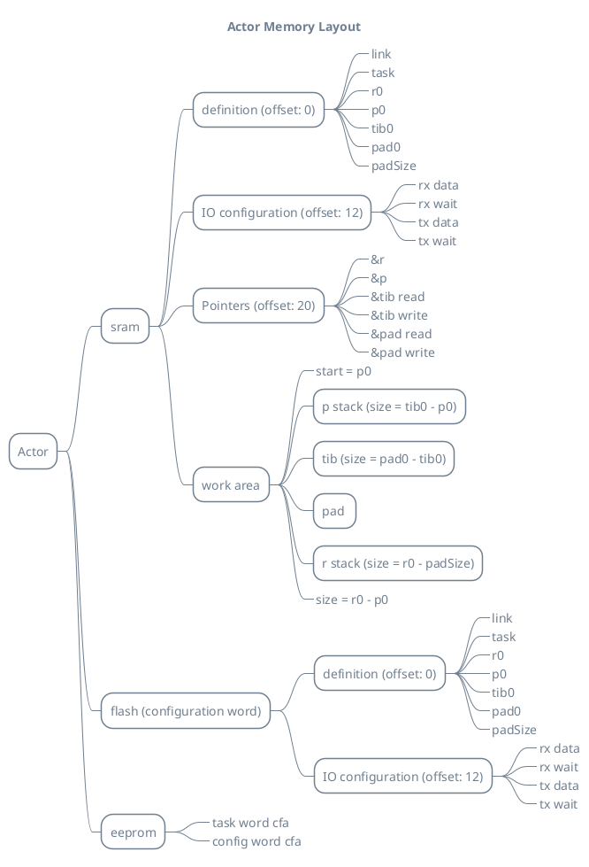

```plantuml
skinparam BackgroundColor transparent
@startmindmap
@startmindmap
<style>
    node {
        FontColor SlateGrey
        BackgroundColor transparent
        LineColor SlateGrey
        Shadowing 0.0
    }
    arrow {
        LineColor SlateGrey
    }
</style>
skinparam BackgroundColor transparent
skinparam titleFontColor SlateGrey
title Actor Memory Layout
* Actor

** sram
*** definition (offset: 0)
****_ link
****_ task
****_ r0
****_ p0
****_ tib0
****_ pad0
****_ padSize
*** IO configuration (offset: 12)
****_ rx data
****_ rx wait
****_ tx data
****_ tx wait
*** Pointers (offset: 20)
****_ &r
****_ &p
****_ &tib read
****_ &tib write
****_ &pad read
****_ &pad write 
*** work area
****_ start = p0
**** p stack (size = tib0 - p0)
**** tib (size = pad0 - tib0)
**** pad 
**** r stack (size = r0 - padSize)
****_ size = r0 - p0

** flash (configuration word)
*** definition (offset: 0)
****_ link
****_ task
****_ r0
****_ p0
****_ tib0
****_ pad0
****_ padSize
*** IO configuration (offset: 12)
****_ rx data
****_ rx wait
****_ tx data
****_ tx wait

** eeprom
***_ task word cfa
***_ config word cfa
@endmindmap
```