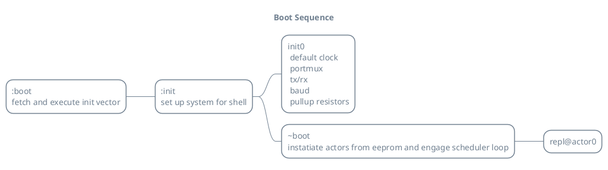

```plantuml
skinparam BackgroundColor transparent
@startmindmap
@startmindmap
<style>
    node {
        FontColor SlateGrey
        BackgroundColor transparent
        LineColor SlateGrey
        Shadowing 0.0
    }
    arrow {
        LineColor SlateGrey
    }
</style>
skinparam BackgroundColor transparent
skinparam titleFontColor SlateGrey
title Boot Sequence
* :boot \nfetch and execute init vector
** :init \nset up system for shell
*** init0 \n default clock\n portmux\n tx/rx\n baud\n pullup resistors
*** ~boot \ninstatiate actors from eeprom and engage scheduler loop
**** repl@actor0
@endmindmap
```