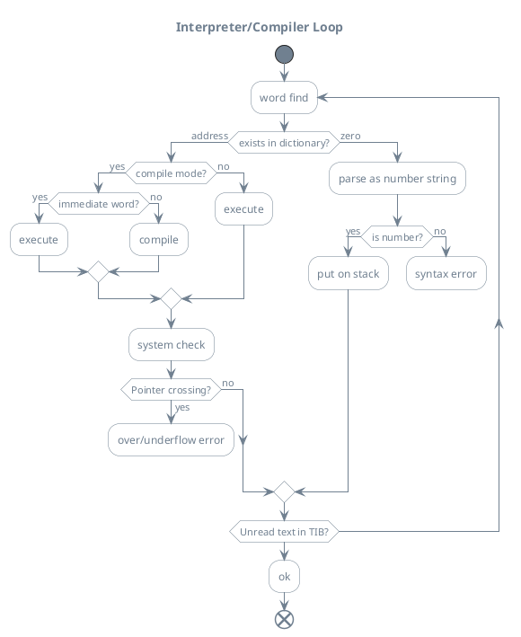

```plantuml
@startuml
skinparam BackgroundColor transparent
skinparam Shadowing false
skinparam activity {
    FontColor SlateGrey
    BackgroundColor transparent
    ArrowColor SlateGrey
    BorderColor SlateGrey
    StartColor SlateGrey
    EndColor SlateGrey
}

skinparam activityDiamond {
    FontColor SlateGrey
    BackgroundColor transparent
    BorderColor SlateGrey
}


skinparam arrow {
    FontColor SlateGrey
}

skinparam BackgroundColor transparent
skinparam titleFontColor SlateGrey
title Interpreter/Compiler Loop
start 
repeat :word find;
    if (exists in dictionary?) then (address)
        if (compile mode?) then (yes)
            if (immediate word?) then (yes)
                 :execute;
            else (no)
                 :compile;
            endif
        else (no)
            :execute;
        endif
        :system check;
        if (Pointer crossing?) then (yes)
            :over/underflow error;
            kill
        else (no)
        endif
    else(zero)
        :parse as number string;
        if (is number?) then (yes)
            :put on stack;
        else (no)
            :syntax error;
            kill
        endif
    endif
repeatwhile(Unread text in TIB?)
    :ok;
    end
@enduml
```
