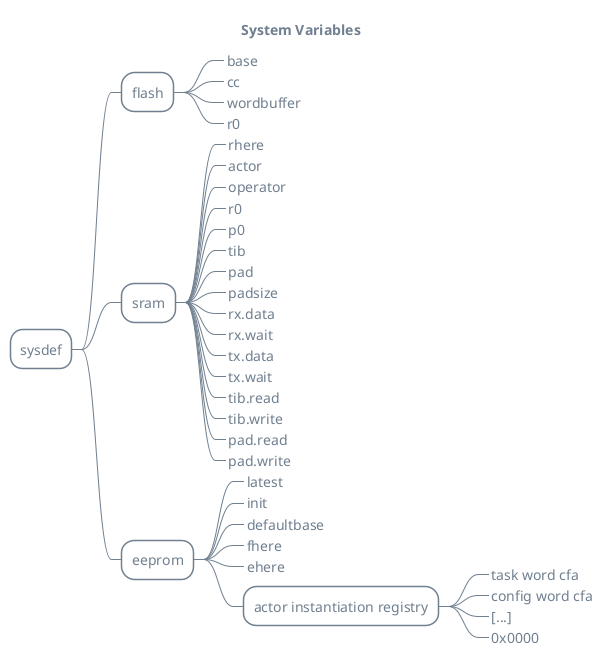

```plantuml
skinparam BackgroundColor transparent
@startmindmap
<style>
    node {
        FontColor SlateGrey
        BackgroundColor transparent
        LineColor SlateGrey
        Shadowing 0.0
    }
    arrow {
        LineColor SlateGrey
    }
</style>
skinparam BackgroundColor transparent
skinparam titleFontColor SlateGrey

title System Variables
* sysdef
** flash
***_ base
***_ cc
***_ wordbuffer
***_ r0
** sram
***_ rhere
***_ actor
***_ operator
***_ r0
***_ p0
***_ tib
***_ pad
***_ padsize
***_ rx.data
***_ rx.wait
***_ tx.data
***_ tx.wait
***_ tib.read
***_ tib.write
***_ pad.read
***_ pad.write
** eeprom
***_ latest
***_ init
***_ defaultbase
***_ fhere
***_ ehere
*** actor instantiation registry
****_ task word cfa
****_ config word cfa
****_ [...]
****_ 0x0000
@endmindmap
```