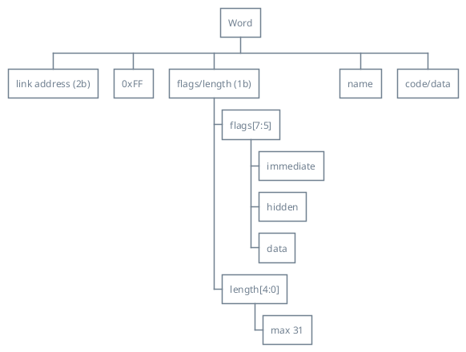

```plantuml
skinparam BackgroundColor transparent
@startwbs
skinparam BackgroundColor transparent
@startwbs
<style>
    node {
        FontColor SlateGrey
        BackgroundColor transparent
        LineColor SlateGrey
        Shadowing 0.0
    }
    arrow {
        LineColor SlateGrey
    }
</style>
skinparam BackgroundColor transparent
skinparam titleFontColor SlateGrey
* Word
** link address (2b)
** 0xFF 
** flags/length (1b)
*** flags[7:5]
**** immediate
**** hidden
**** data
*** length[4:0]
**** max 31
** name
** code/data
@endwbs
```
