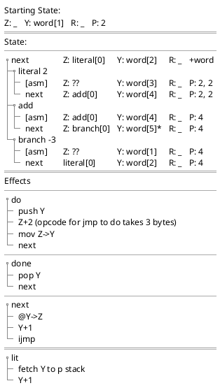

# Execution model example:

### : word  literal  2  +  branch  -3 ;
an infinite loop that adds two to an accumulator
notice the 'do' call is bypassed as in the main loop

```plantuml
@startsalt
{
    Starting State:
    {T
        | Z: _ | Y: word[1] | R: _ | P: 2
    }
    ==
    State:
    --
    {T        
    +next       | Z: literal[0] | Y: word[2] | R: _ | 
    +word       
    ++literal 2 
    +++[asm]    | Z: ?? | Y: word[3] | R: _ | P: 2, 2
    +++next     | Z: add[0] | Y: word[4] | R: _ | P: 2, 2
    ++add
    +++[asm]    | Z: add[0] | Y: word[4] | R: _ | P: 4
    +++next     | Z: branch[0] | Y: word[5]*  | R: _ | P: 4
    ++branch -3
    +++[asm]    | Z: ?? | Y: word[1] | R: _ | P: 4
    +++next     | literal[0]  | Y: word[2] | R: _ | P: 4
    }
    ==
    Effects
    --
    {T
    +do
    ++push Y
    ++Z+2 (opcode for jmp to do takes 3 bytes)
    ++mov Z->Y
    ++next
    }
    --
    {T
    +done
    ++pop Y
    ++next
    }
    --
    {T
    +next
    ++@Y->Z
    ++Y+1
    ++ijmp
    }
    ==
    {T
    +lit
    ++fetch Y to p stack
    ++Y+1
    }
}

@endsalt
```